# MINDA — Implementation Plan

*Learn. Practice. Master.*

MINDA is an upgrade of the existing StudyUp codebase, not a rewrite. The student learning loop, the deterministic services (mastery, randomizer, grading, recommendations, analytics), the teacher dashboards, the exam generator and the communities are kept and extended phase by phase.

Status legend used below: **existing** (already in StudyUp), **P1** … **P7** (phase that introduces it).

---

## 1. Recommended architecture

A modular monolith: one React SPA, one FastAPI service, one PostgreSQL database. No microservices, queues, Redis or Kubernetes.

```
Browser (React SPA) ──REST/JSON──► FastAPI (/api/*) ──SQLAlchemy──► PostgreSQL
        │                              │                            (local Postgres in dev,
        │                              │                             Supabase Postgres in prod)
        └── Supabase Auth (prod only) ─┘ JWT verified by FastAPI
```

| Concern | Decision |
| --- | --- |
| Identity | Pluggable provider selected by `AUTH_MODE`. `local` (development / self-hosted): FastAPI verifies scrypt password hashes kept in `local_credentials` and issues short-lived HS256 JWTs. `supabase` (production): Supabase Auth issues JWTs, FastAPI verifies them (JWKS or legacy secret). Application data never depends on which provider is active: both resolve to a `profiles` row. |
| Authorisation | FastAPI is the enforcement point. Every protected route runs: token → profile → account status → role guard → resource-scope check (`app/permissions.py` + `app/services/access.py`). RLS in Supabase is defence in depth for any direct client access. |
| Teacher responsibilities | One `teacher` role. "Class teacher" and "subject teacher" are derived at request time from `classes.class_teacher_id` and `teacher_subjects`, never stored as a role or flag. |
| Business logic | Deterministic Python in `app/services/*` (scoring, mastery, randomisation, access). Routers stay thin. |
| Schema changes | Alembic migrations (`backend/migrations`). Local SQLite (tests) may still use `create_all`; PostgreSQL always uses migrations. |
| Frontend data | TanStack Query for new pages (P1+), migrating existing `useApi` pages gradually. Forms use React Hook Form + Zod. |
| AI | Behind `AI_FEATURES_ENABLED` (default `false`). When off, `/api/ai/*` returns 404 and the UI hides every AI entry point. All core features work without it. |
| Files | Supabase Storage (prod) behind a small storage service interface, introduced in P3 with question images / memo attachments. |
| Email | `Mailer` interface. Development uses a console mailer (reset links printed to the API console); production plugs in SMTP or Supabase's own emails. |

### Why a local password provider exists

Supabase Auth is the production identity provider, but the project must run fully offline against local PostgreSQL. `local_credentials` is a stand-in for `auth.users`: it stores only salted scrypt hashes, is never exposed through any API, and is empty when `AUTH_MODE=supabase`. No other application table stores passwords.

---

## 2. Project folder structure

```
StudyUp/
├── docs/PLAN.md                      ← this document
├── backend/
│   ├── alembic.ini                   P1
│   ├── migrations/                   P1  Alembic env + versions/
│   ├── requirements.txt
│   ├── app/
│   │   ├── main.py                   FastAPI app + router registration
│   │   ├── config.py                 Settings (env vars), dev/prod differences
│   │   ├── database.py               engine, session, init
│   │   ├── models.py                 SQLAlchemy models (split into models/ package when it passes ~800 lines)
│   │   ├── schemas.py                Pydantic request/response schemas
│   │   ├── security.py               token issue/verify, current user, account status
│   │   ├── permissions.py        P1  role guards (require_admin/teacher/student/roles)
│   │   ├── cli.py                P1  protected admin commands (create-admin)
│   │   ├── routers/
│   │   │   ├── auth.py               login, me, password recovery
│   │   │   ├── admin.py          P1  admin overview + audit log (grows into admin/ package in P2)
│   │   │   ├── subjects.py lessons.py quiz.py practice.py students.py
│   │   │   ├── teachers.py exams.py community.py
│   │   │   └── ai.py                 feature-flagged
│   │   ├── services/
│   │   │   ├── access.py             teacher/student scope rules
│   │   │   ├── audit.py          P1  audit log writer
│   │   │   ├── passwords.py      P1  hashing, policy, reset tokens
│   │   │   ├── rate_limit.py     P1  in-process sliding-window limiter
│   │   │   ├── mailer.py         P1  console / SMTP mailer
│   │   │   └── mastery.py randomizer.py grading.py … (existing)
│   │   └── seed/                     demo data (development only)
│   └── tests/
├── frontend/src/
│   ├── App.tsx                       routes per role
│   ├── components/                   app-shell, ui/ (shadcn-style), shared widgets
│   ├── lib/                          api, auth, query client, utils
│   └── pages/
│       ├── auth/                 P1  ForgotPassword, ResetPassword
│       ├── shared/               P1  Profile, NotFound, AccessDenied (Memos, Notifications later)
│       ├── admin/                P1  Dashboard, AuditLog (Users, Classes, Subjects … P2–P3)
│       ├── teacher/ student/ community/
└── supabase/migrations/              RLS policies + auth triggers for the Supabase deployment
```

---

## 3. Entity relationship diagram

Core relationships of the target schema. Columns are abbreviated; every table has a UUID `id` and timestamps unless it is a pure join table.

```mermaid
erDiagram
    schools ||--o{ profiles : "has members"
    schools ||--o{ academic_years : has
    academic_years ||--o{ academic_terms : has
    academic_years ||--o{ classes : "runs in"
    schools ||--o{ classes : has
    profiles ||--o{ classes : "class teacher of"
    classes ||--o{ class_students : enrols
    profiles ||--o{ class_students : "enrolled as student"
    profiles ||--o{ teacher_subjects : "teaches"
    subjects ||--o{ teacher_subjects : "taught as"
    classes ||--o{ teacher_subjects : "in class"
    profiles ||--o| local_credentials : "local login (dev)"
    profiles ||--o{ password_reset_tokens : "recovery"
    profiles ||--o{ audit_logs : "actor"

    subjects ||--o{ topics : contains
    topics ||--o{ topics : "parent of (subtopics)"
    topics ||--o{ learning_objectives : has
    topics ||--o{ lessons : has
    lessons ||--o{ lesson_slides : has
    topics ||--o{ questions : "tagged"
    subjects ||--o{ questions : "belongs to"

    profiles ||--o{ question_attempts : answers
    questions ||--o{ question_attempts : "answered in"
    question_sets ||--o{ question_set_questions : "ordered items"
    questions ||--o{ question_set_questions : "selected in"
    question_sets ||--o{ question_attempts : "attempt context"
    profiles ||--o{ student_topic_progress : "mastery per topic"
    profiles ||--o{ lesson_progress : "lesson state"

    profiles ||--o{ assignments : "created by teacher"
    classes ||--o{ assignments : "targets"
    assignments ||--|| question_sets : "uses"
    assignments ||--o{ assignment_students : "assigned to"
    question_sets ||--o{ exam_attempts : "taken as exam"

    schools ||--o{ school_memos : publishes
    school_memos ||--o{ memo_reads : "read by"
    school_memos ||--o{ memo_acknowledgements : "acknowledged by"

    profiles ||--o{ posts : writes
    posts ||--o{ comments : has
    posts ||--o{ post_votes : "voted"
    posts ||--o{ post_bookmarks : "saved"
    posts ||--o{ content_reports : "reported"

    profiles ||--o{ notifications : receives
    profiles ||--o{ student_xp_events : earns
    profiles ||--o{ student_badges : earns
```



### Relationship notes

- **School scope.** `profiles.school_id`, `classes.school_id` and `posts.school_id` tie every record to one school. All teacher/student queries are filtered by it; another school's student community is never visible.
- **Teacher scope is derived.** A teacher can see a student's data for subject *S* iff the student is enrolled (`class_students`) in a class *C* where the teacher has a `teacher_subjects(teacher, S, C)` row; class teachers (`classes.class_teacher_id`) get cross-subject *summaries* for their class.
- **Question sets** are the shared container for quizzes, practice sessions, assignments and exams (`kind` column). `question_set_questions` freezes the selected questions and their order, so a practice set or published exam never changes after it starts.
- **Attempts are history; progress is a summary.** `question_attempts` stores every answer; `student_topic_progress` is recomputed from it, so mastery can be recalculated if the formula changes.
- **Archive, don't delete.** Subjects, topics, lessons, questions, classes and memos get a `status` (`draft | published | archived`); profiles get `status` (`active | disabled`). Hard deletes are only allowed for records with no history.

---

## 4. Role–permission matrix

`✔` allowed · `scope` allowed within assignments/ownership · `read` read-only · `—` denied (enforced by the backend, not just hidden in the UI).

| Capability | Admin | Teacher | Student |
| --- | --- | --- | --- |
| Sign in, change own password, view own profile | ✔ | ✔ | ✔ |
| Create / disable / reactivate accounts, trigger password reset | ✔ | — | — |
| Create admin accounts | CLI only | — | — |
| School profile, academic years, terms, calendar (school events) | ✔ | read | read |
| Classes, enrolments, transfers, teacher assignments | ✔ | read (own classes) | read (own class) |
| Subjects, topics, objectives (official structure) | ✔ | read (published) | read (published) |
| Lessons | ✔ | read | read (published) |
| Question bank incl. answer keys | ✔ | read (taught subjects) | — (answers only after submission) |
| School memos: create, edit, publish, archive, ack report | ✔ | — | — |
| School memos: read published, acknowledge | ✔ | ✔ | ✔ |
| Audit log | ✔ | — | — |
| Student progress — per subject detail | ✔ | scope: subject teacher of that class+subject | own only |
| Student progress — cross-subject class summary | ✔ | scope: class teacher of that class | own only |
| Assignments: create / monitor | — | scope: taught class + subject | — |
| Assignments: start / submit / review | — | — | own only |
| Exam generator, publish exam | — | scope: taught class + subject | — |
| Take exam, view results after release | — | — | own only |
| Learn, quiz, practice | — | preview | ✔ |
| Teacher community | moderate | ✔ | — |
| Student community (own school) | moderate | read | ✔ |
| Notifications | own | own | own |
| AI features (when enabled) | — | ✔ | ✔ |

A teacher who is both class teacher and subject teacher gets the union of both scopes.

---

## 5. Database tables and relationships

Existing StudyUp table names are kept where they already fit, to avoid a disruptive rename. The spec's suggested name is shown where it differs.

### Identity and school administration

| Table | Status | Key relationships / constraints |
| --- | --- | --- |
| `schools` | existing, profile fields P2 | name, state; P2 adds `logo_url` (https URL), address, phone, email, timezone, description |
| `profiles` | existing, P1 adds `username` (unique), `status`, `last_login_at`, `updated_at`; drops `teacher_types` | `id` = `auth.users.id` on Supabase; `school_id → schools`; role ∈ admin/teacher/student. P2 adds `student_number` / `staff_number` (unique per school), department |
| `local_credentials` | P1 | PK/FK `profile_id → profiles`; scrypt hash only; local auth mode |
| `password_reset_tokens` | P1 | `profile_id → profiles`; SHA-256 of token (unique), `expires_at`, `used_at`, `requested_by → profiles` |
| `audit_logs` (spec: `user_audit_logs`) | P1 | `actor_id → profiles` (nullable for system), action, resource type/id, `school_id`, non-sensitive JSON details |
| `academic_years`, `academic_terms` | P2 | years unique (school, name), end > start, one current year per school (service rule); terms unique (year, name), inside the year, non-overlapping |
| `classes` | existing, P2 replaces `year` with `academic_year_id`, adds `status` (active/archived) | the class name is its code: unique (academic_year, name); form 1–5. Archived classes grant teachers no access |
| `class_students` (spec: `class_enrolments`) | existing, P2 adds `enrolled_at`, `left_at`, `status` (active/transferred/withdrawn) | PK (class, student) → duplicate enrolment impossible; at most one active enrolment per student per academic year; transfers and withdrawals close the row instead of deleting it |
| `teacher_subjects` (spec: `teacher_subject_assignments` + `teacher_class_assignments`) | existing | unique (teacher, subject, class). Class-teacher link is `classes.class_teacher_id` |
| `student_subjects` | existing | PK (student, subject) |

### Academic content

| Table | Status | Notes |
| --- | --- | --- |
| `subjects` | existing, P3 adds `status`, visibility, form levels (`subject_form_levels`) | unique `code` |
| `topics` | existing, P3 adds `parent_id` (subtopics), `status`, prerequisites | `subject_id → subjects` |
| `learning_objectives` | P3 | `topic_id → topics`, ordered |
| `lessons`, `lesson_slides` | existing, P3 adds `status` | slides ordered by `position` |
| `questions` | existing, P3 adds `form`, source/attribution fields, `status` = draft/published/archived | `topic_id`, `subject_id`; options JSON for MCQ (can be normalised into `question_options` later without API change) |

### Learning and assessments

| Table | Status | Notes |
| --- | --- | --- |
| `question_sets` + `question_set_questions` (spec: `practice_sessions`, `exams`, `assignment_questions`, `exam_questions`) | existing | one container with `kind`; ordered, frozen question list |
| `question_attempts` | existing | one row per answer; P4 adds unique (set, question, student) for scored sets to block duplicate scoring |
| `student_topic_progress`, `lesson_progress` | existing | derived summaries |
| `assignments`, `assignment_students` (spec: `assignment_submissions`) | existing, P5 adds `class_id`, availability window, feedback release, status | |
| `exam_attempts`, `exam_answers` | P5 | timestamps, status, marks; answers hidden until release time |

### Community, memos, notifications, gamification

| Table | Status | Notes |
| --- | --- | --- |
| `posts`, `comments`, `post_votes` (spec: `discussion_*`) | existing | `space` = student/teacher, `school_id` scoping; PK (post, user) on votes |
| `post_bookmarks`, `content_reports` | P6 | |
| `school_memos`, `memo_attachments`, `memo_reads`, `memo_acknowledgements` | P3 | unique (memo, user) on reads/acks |
| `notifications` | existing | |
| `badges`, `student_badges` | existing | |
| `student_xp_events`, `student_daily_activity` | P6 | XP becomes recomputable from events |
| `ai_cache`, `ai_interactions` (spec: `ai_usage_logs`) | existing | only written when AI is enabled; `ai_feature_settings` added if per-school toggles are needed |

---

## 6. API specification

Conventions: JSON bodies; errors are `{"detail": "<message>"}` or, for auth errors the client must react to, `{"detail": {"code": "...", "message": "..."}}`. `401` = missing/invalid/expired token, `403` = authenticated but not allowed (including disabled accounts, code `account_disabled`), `404` = not found **or** not visible to the caller, `409` = conflict, `422` = validation, `429` = rate limited.

### Phase 1 endpoints (implemented)

| Method & path | Purpose | Request | Response | Auth / role / scope | Errors |
| --- | --- | --- | --- | --- | --- |
| `GET /api/health` | Liveness | — | `{status, auth_mode, ai_enabled}` | public | — |
| `GET /api/auth/config` | Client bootstrap | — | `{mode, ai_enabled, password_recovery}` | public | — |
| `GET /api/auth/demo-accounts` | Demo account picker | — | `[{email, full_name, role, teacher_types}]` | public, **only** `AUTH_MODE=local` and `ENVIRONMENT=development` | 404 otherwise |
| `POST /api/auth/login` | Sign in with email or username | `{identifier, password}` | `{access_token, token_type, expires_in, user}` | public, local mode | 401 generic "Incorrect email/username or password"; 403 `account_disabled` (only after a correct password); 429 after 5 failures / 15 min per identifier+IP; 404 in Supabase mode |
| `GET /api/auth/me` | Current profile | — | `User` incl. derived `teacher_types` | any active user | 401, 403 `account_disabled` |
| `POST /api/auth/forgot-password` | Start recovery | `{identifier}` | `202 {message}` (identical whether or not the account exists) | public, local mode | 429; 404 in Supabase mode (client calls Supabase directly) |
| `POST /api/auth/reset-password` | Finish recovery | `{token, new_password}` | `{message}` | public, local mode; token single-use, 30 min TTL | 400 invalid/expired token; 422 weak password |
| `POST /api/auth/change-password` | Change own password | `{current_password, new_password}` | `{message}` | any active user, local mode | 400 wrong current password; 422 weak password; 429 |
| `GET /api/admin/overview` | Admin dashboard counts + recent activity | — | `{counts{…}, recent_activity[]}` | admin, own school | 403 |
| `GET /api/admin/audit-logs` | Audit history | `?page&page_size&action&actor_id` | `{items[], total, page, page_size}` | admin, own school | 403, 422 |

Password policy: 8–128 characters, at least one letter and one digit, not equal to the identifier. Issuing a new password (reset or change) invalidates all tokens issued before it.

### Phase 2 endpoints (implemented)

Every route below requires an **active admin** (`require_admin`) and is scoped to the admin's school by `services/school_scope.py`: an id from another school returns `404`, exactly like an id that does not exist. Admin accounts cannot be edited, disabled or reset through the API (`403`, "managed with the server CLI"); the role can never be set to `admin` by a request (`role` is `Literal["student","teacher"]`, so `422`). Every write is recorded in the audit log without passwords or tokens.

| Method & path | Purpose | Request | Response | Errors |
| --- | --- | --- | --- | --- |
| `GET /api/admin/overview` | Dashboard | — | `{current_academic_year, counts, alerts[{kind,message,link}], content[{subject,topics,topics_with_lessons,topics_with_questions}], recent_accounts, recent_activity}` | — |
| `GET /api/admin/lookups` | Options for forms | — | `{subjects, classes (active), teachers, academic_years}` | — |
| `GET /api/admin/users` | Directory | `?q&role&status&class_id&subject_id&created_from&created_to&page&page_size≤100` | `{items[], total, page, page_size}` | 422 |
| `GET /api/admin/users/{id}` | Detail | — | profile, `credentials_set`, `manageable`, class, `enrolments` history, subjects, teaching, `recent_activity` | 404 |
| `POST /api/admin/users` | Create student/teacher | `{role, full_name, email, username?, status, student_number + form? \| staff_number + department?, class_id?, subject_ids?, assignments?[{subject_id, class_id}], send_invite}` | `201 {user, invitation{delivered, message} \| null}` | 409 duplicate email/username/ID (field-specific) or archived class; 422; 501 in Supabase mode |
| `PATCH /api/admin/users/{id}` | Edit | any subset of the identity fields | user | 403 admin; 409; 422 |
| `POST /api/admin/users/{id}/disable` / `reactivate` | Account status (disabling also voids unused set/reset links) | — | user | 403 admin accounts |
| `POST /api/admin/users/{id}/reset-password` | Send a single-use set-password link | — | `{initiated, delivered, message}` | 403 admin; 409 disabled; 429 (5 per window); 501 in Supabase mode |
| `PUT /api/admin/users/{id}/class` | Place a student: enrol, transfer within the same year, or withdraw (`null`) | `{class_id \| null}` | user detail | 409 archived class; 422 |
| `PUT /api/admin/users/{id}/subjects` | Student subject choices | `{subject_ids[]}` | user detail | 422 |
| `POST /api/admin/users/import/preview` | Validate a CSV | `{csv ≤ 512 KB, send_invites}` | `{header_errors[], rows[{line, status ready/error, errors[], …}], summary}` | 422 |
| `POST /api/admin/users/import/confirm` | Create the valid rows | same | `{created[], failed[], summary}` (each row in its own savepoint) | 422 header errors |
| `GET` / `PUT /api/admin/school` | School profile | `{name, state, address, phone, email, logo_url (https), timezone, description}` | profile + `timezones[]` | 422 |
| `GET` / `POST /api/admin/academic-years` | List / create year | `{name, start_date, end_date, is_current}` | year(s) with `terms[]`, `class_count` | 409 duplicate name; 422 dates |
| `PUT /api/admin/academic-years/{id}` | Edit year | same | year | 409; 422 terms outside new dates |
| `POST /api/admin/academic-years/{id}/set-current` | Switch current year | — | year | 404 |
| `POST /api/admin/academic-years/{id}/terms` | Add term | `{name, start_date, end_date}` | year | 409 name; 422 outside year / overlap |
| `PUT` / `DELETE /api/admin/academic-terms/{id}` | Edit / delete term | same | the parent year | 409; 422 |
| `GET /api/admin/classes` | Class list | `?academic_year_id&status=active\|archived\|all` | `[{…, class_teacher, student_count, subject_count}]` | 422 |
| `POST /api/admin/classes` | Create | `{name, form, academic_year_id, class_teacher_id?}` | `201` class detail | 409 name taken in that year or disabled teacher; 422 |
| `GET` / `PATCH /api/admin/classes/{id}` | Detail (roster incl. history, teaching) / edit | `{name?, form?, class_teacher_id?}` | class detail | 409 archived, duplicate name or disabled teacher |
| `POST /api/admin/classes/{id}/archive` / `restore` | Archive keeps history; teachers lose access | — | class detail | 409 restore when the name is now taken |
| `GET /api/admin/classes/{id}/eligible-students` | Active students with no active class in that year (max 200) | `?q` (name or student ID) | `[{id, full_name, student_number, form}]` | — |
| `POST /api/admin/classes/{id}/students` | Bulk enrol | `{student_ids[1..200]}` | `{enrolled[], already_enrolled[], failed[{id, reason}], class}` | 409 archived |
| `POST /api/admin/classes/{id}/students/{sid}/transfer` | Transfer within the same year | `{to_class_id}` | source class detail | 404 not enrolled; 409 target archived; 422 different year |
| `DELETE /api/admin/classes/{id}/students/{sid}` | Withdraw (row kept as `withdrawn`) | — | class detail | 404 |
| `GET` / `POST /api/admin/teacher-assignments` | List (`?teacher_id&class_id&subject_id&include_archived`) / add | `{teacher_id, subject_id, class_id}` | assignment(s); `201` on add | 409 duplicate, disabled teacher or archived class |
| `DELETE /api/admin/teacher-assignments/{id}` | Remove | — | `{deleted}` | 404 |

CSV import format: header row required, columns `role, full_name, email` plus optional `username, student_number, staff_number, form, class, department`; up to 500 rows. The preview flags missing/unknown headers, invalid values, duplicates inside the file and conflicts with existing accounts; confirm creates only the rows that are still valid and reports the rest.

Invitations: new accounts get no password. With `send_invite` (or `send_invites` for imports) the backend issues a single-use set-password link valid for `INVITE_TTL_HOURS` (default 72); "Send set-password link" on the user page issues a fresh one with the same lifetime (worded as an invitation if the user has never set a password, otherwise as a reset). Self-service "forgot password" links still use `PASSWORD_RESET_TTL_MINUTES`. In development the link is printed to the API console.

### Later phases (route groups and guards)

| Group | Phase | Role | Scope rule |
| --- | --- | --- | --- |
| `/api/admin/subjects`, `/api/admin/topics`, `/api/admin/lessons`, `/api/admin/questions` | P3 | admin | central content |
| `/api/admin/memos` (+ ack report export) | P3 | admin | own school |
| `/api/memos` (list, detail, read, acknowledge) | P3 | any | published, `publish_at ≤ now`, not expired/archived, own school |
| `/api/students/me/*` (dashboard, subjects, progress) | existing → P4 | student | self |
| `/api/subjects`, `/api/topics`, `/api/lessons`, `/api/quiz`, `/api/practice` | existing → P4 | student (teachers read) | published content only |
| `/api/teachers/*` (context, classes, subject progress, student detail, alerts) | existing → P5 | teacher | `services/access.py` |
| `/api/teachers/assignments`, `/api/students/me/assignments`, `/api/practice/sets/*` | P5 ✅ | teacher / student | visible students / own; `available_from`, due date, `feedback_release` |
| `/api/exams` (generate, replace, save, list, get, delete) | existing | teacher | teaches the subject; own exams |
| `POST /api/exams/{id}/publish`, `GET /api/exams/{id}/publications`, `DELETE /api/exams/publications/{id}`, `GET /api/exams/publications/{id}/results` | P5 ✅ | teacher | own exam + class teacher of the class or assigned that subject in that class; schedule fixed once attempts exist |
| `GET /api/my-exams`, `POST /api/my-exams/{id}/start`, `GET /api/my-exams/{id}`, `POST /api/my-exams/{id}/answer`, `POST /api/my-exams/{id}/submit` | P5 ✅ | student | active enrolment in the class (404 otherwise); open window; marks/answers only after `release_at` |
| `/api/community/posts` (list with `saved`, create), `/posts/{id}` (get, delete own), `/posts/{id}/comments` (with `parent_id`), `/posts/{id}/vote`, `PUT/DELETE /posts/{id}/bookmark`, `/posts/{id}/report`, `/comments/{id}/report`, `DELETE /comments/{id}` | P6 ✅ | teacher space: teacher/admin; student space: same-school members, students write | hidden content only for author and moderator; rate limited |
| `/api/community/reports`, `/posts/{id}/moderation`, `/comments/{id}/moderation` | P6 ✅ | admin | content owned by the admin's school |
| `/api/notifications` (list, `unread-count`, `{id}/read`, `read-all`) | P6 ✅ | any | own |
| `/api/calendar?start&end` | P6 ✅ | any | own school, audience by role, own deadlines/exams |
| `/api/admin/calendar` (create, update, delete) | P6 ✅ | admin | own school |
| `/api/students/me/xp`, `/api/gamification/rules` | P6 ✅ | student / any | own ledger / public rules |
| `/api/ai/*` | existing, flagged | teacher / student | `AI_FEATURES_ENABLED` |

Detailed per-endpoint specs for each later phase are written at the start of that phase, following the Phase 1 table format.

---

## 7. Phased development sequence

| Phase | Scope | Exit criteria |
| --- | --- | --- |
| **1 Foundation** | Alembic baseline + migrations on local Postgres; three roles; per-user password login (email or username); account status; password recovery + change; centralised role guards; audit log; admin CLI bootstrap; derived teacher responsibilities; AI feature flag; role-adaptive layout with Admin area, Profile, 404 and access-denied pages; this plan | Migrations apply to an empty DB and match the models; auth/RBAC tests pass; all three roles can sign in locally |
| **2 Admin & school** ✅ implemented | Admin dashboard (full), user directory + create/edit/disable, admin-initiated reset, CSV import with preview, school profile, academic years/terms, classes, enrolment/transfer, teacher assignments | Admin can run a school without touching SQL; cross-school isolation tests |
| **3 Content & memos** ✅ implemented | Subject/topic/subtopic/objective/lesson/question management with draft → published → archived; local file storage for images and attachments (Supabase Storage can replace the storage service); school memos with reads, acknowledgements and a CSV report | Students only see published content; memo visibility tests |
| **4 Student learning** ✅ implemented | Topic page shows objectives and learn/quiz state; dashboard counts published topics only; 10-question quizzes; submitting or answering again does not award XP twice (unique answer per set); `GET /api/learning/config` exposes mastery thresholds; past-year practice filter | Duplicate submission/XP tests; quiz selection tests |
| **5 Teacher tools** ✅ implemented | Assignments with an opening time, due-date cut-off and "answers after due date" release (correctness, score, XP, badges, mastery and AI answer checks held until release); exams published per class with open/close window, optional time limit and answer-release time; student exam attempts (one final answer per question, auto-submit at deadline, separate `exam_answers` table); per-class teacher results. Dashboard shows window and release on recent assignments. Class/subject analytics are the existing views, unchanged. **Deferred:** item analysis per question, exporting results, editing a schedule after students start, manual marking of structured answers (marking is automatic) | Scope and answer-release tests (`tests/test_teacher_tools.py`) |
| **6 Community & engagement** ✅ implemented | Bookmarks, one-level replies, reports with an admin moderation queue (hide / restore / keep, auto-hide at 3 reporters), link and contact filtering in the student space, per-user rate limits, notifications page and bell, `student_xp_events` ledger and published XP rules, school calendar (admin events by audience, terms, personal deadlines and exams). The teacher community stays shared across schools; moderation goes to the author's school admin. **Deferred:** class-specific student spaces, image attachments in posts, scheduled reminders (upcoming deadline, results released), email/push notifications, comment voting | Community isolation and voting tests (`tests/test_community.py`) |
| **7 Hardening & deploy** | Full role walkthroughs, responsive fixes, demo data review, deployment docs, deploy | All suites green |

Deferred beyond the MVP: PDF exams, parent portal, attendance, timetable, email/push notifications, advanced calendar integrations, and every AI feature beyond the existing flagged ones.
